<div align="center">

# 🦄 org.nvim

### Emacs Org mode, rebuilt for Neovim in pure Lua.

Outlines · TODOs · Agenda · Capture · Clocking · Spreadsheet tables · Babel · Export

[](https://neovim.io)
[](lua/org)
[](#requirements)
[](CONTRIBUTING.md)
[](https://ko-fi.com/xheisenbugx)

**[Install](#-install-in-30-seconds)** ·
**[Tour](#-a-quick-tour)** ·
**[Features](#-features)** ·
**[Docs](doc/org.txt)** ·
**[Contributing](CONTRIBUTING.md)**

<br>


</div>

---

Org mode is one of the most loved tools in Emacs. It works as a
plain-text outliner, planner, time tracker, spreadsheet, literate-programming
notebook and publishing system. **org.nvim puts all of that in Neovim.** It
isn't a syntax file with a few keymaps on top. It reimplements Org's
behaviour: the agenda, capture templates, repeaters, clock tables, table
formulas, Babel and export.

- 🪶 **No dependencies.** It's about 24k lines of Lua and needs no
  tree-sitter parser, external binary or companion plugin.
- 🔁 **Works with Emacs.** It reads and writes the same plain-text format,
  so you can edit a file in Emacs today and in Neovim tomorrow.
- ⌨️ **Keys that fit Vim.** Context-aware keys fall back to normal Vim
  behaviour when they don't apply (`>>` still indents, `<C-a>` still
  increments). Press `g?` anywhere to see what's available.
- 💤 **Ready for LazyVim.** It comes with which-key groups, a blink.cmp
  source, `vim.ui.select` pickers and a lualine clock, and it works with
  any other setup too.
- ✅ **Tested.** The headless test suite has 200+ tests across 23 specs.

---

## ⚡ Install in 30 seconds

With [lazy.nvim](https://github.com/folke/lazy.nvim) / LazyVim:

```lua
-- ~/.config/nvim/lua/plugins/org.lua
return {
  "xheisenbugx/org.nvim",
  main = "org",
  lazy = false, -- startup cost is tiny: only :Org and a few global keymaps
  opts = {
    org_directory = "~/org",
    agenda_files = { "~/org/**/*.org" },
    default_notes_file = "~/org/refile.org",
  },
}
```

Restart Neovim and run `:checkhealth org`. Then open
[`examples/tutorial.org`](examples/tutorial.org), a hands-on tour with a
section and exercises for every feature. To try it without touching your
config or your notes, run it from a checkout with the bundled init file:

```sh
nvim -u examples/minimal_init.lua examples/tutorial.org
```

---

## 🎬 A quick tour

Everything below was recorded in a plain Neovim with only org.nvim
installed. The tapes that produce these GIFs live in
[`docs/media`](docs/media), so they can be re-recorded after every change.
In the newer demos, the box in the bottom-right corner shows the key being
pressed.

### Outlines that fold like Emacs

`TAB` cycles a subtree through folded, children and everything.
`S-TAB` does the same for the whole file. You can move a subtree with all
of its children (`<leader>oK` / `<leader>oJ` or `M-k` / `M-j`), promote and
demote it, or cut, paste and sort it.


### Structure editing

`M-RET` adds a heading (or an item, or a table row) at the right level,
and `<leader>oit` adds a TODO heading. `M-h` / `M-l` promote and demote.
`<leader>ohs` sorts the children (alphabetically, by TODO state, priority,
date and more), and `<leader>ohn` narrows to a subtree so you can edit it
on its own.

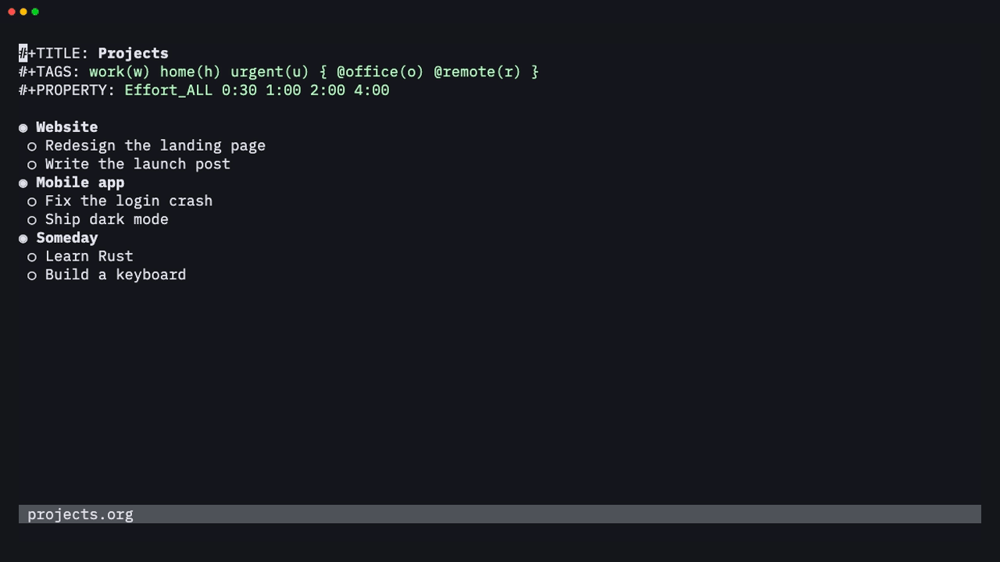

### TODOs, checklists and priorities

Ticking a checkbox updates the `[2/4]` and `[50%]` cookies of its parents.
Marking a task DONE logs a `CLOSED:` timestamp and updates its parent's
cookie. Set the state with `cit` or with the fast-selection menu
(`<leader>oT`), and the priority with `<leader>o,`.

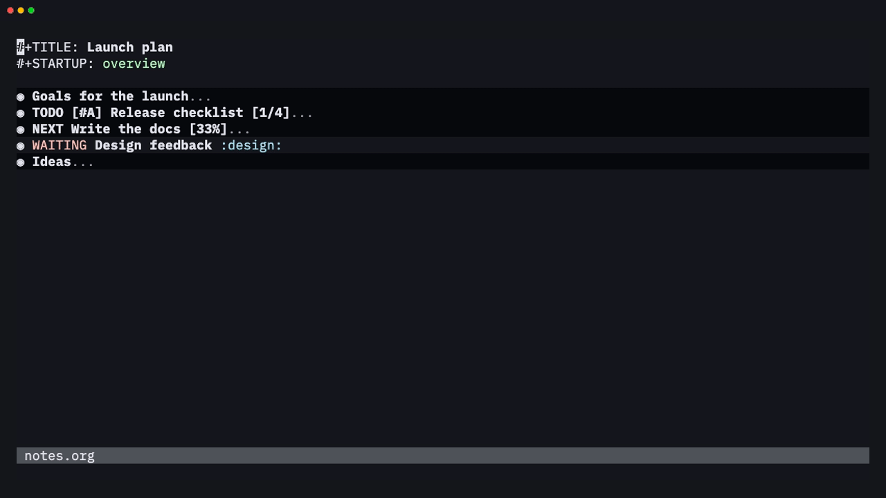

### Plain lists

`S-Right` / `S-Left` on an item cycles the bullet style of the whole list:
`-`, `+`, `1.` and `1)`. `M-RET` adds an item and `M-S-RET` adds a
checkbox item. `TAB` on a new empty item indents it. `M-Up` / `M-Down` move
an item with its children, and numbered lists are renumbered as you go.
`<leader>o-` turns plain lines into a list.

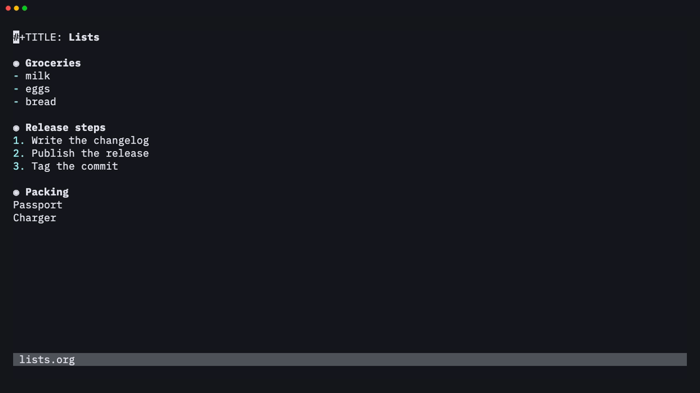

### Tags and properties

`<leader>ot` opens fast tag selection: one key per tag, with mutually
exclusive groups like `{ @office @remote }`. `<leader>oxe` sets the effort
from `Effort_ALL`, and `<leader>op` sets any property.


### Dates with a real calendar

`<leader>os` (schedule) and `<leader>od` (deadline) open a floating
calendar. Move around it with `hjkl`, or press `i` and type a date the way
you'd say it: `fri 14:00`, `+2w`, `sep 15`, `w39`.


You don't need the calendar to change a date. `S-Right` / `S-Left` move it
by a day, `<C-a>` / `<C-x>` (or `S-Up` / `S-Down`) change the part under
the cursor (year, month, day, hour or minutes, rounded to 5), and `<CR>`
on a date opens the agenda for that day.

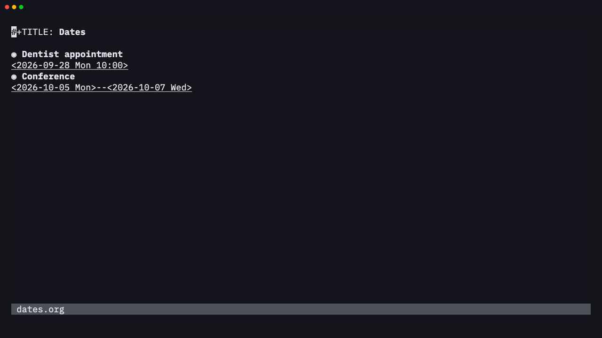

### A real agenda

`<leader>oa` → `a`. The day view has a time grid, a current-time line,
deadline countdowns, overdue items and a habit consistency graph, the
same as in Emacs. From the agenda you can change states, reschedule, clock
in, refile, filter and run bulk actions. `vw` switches to the week.

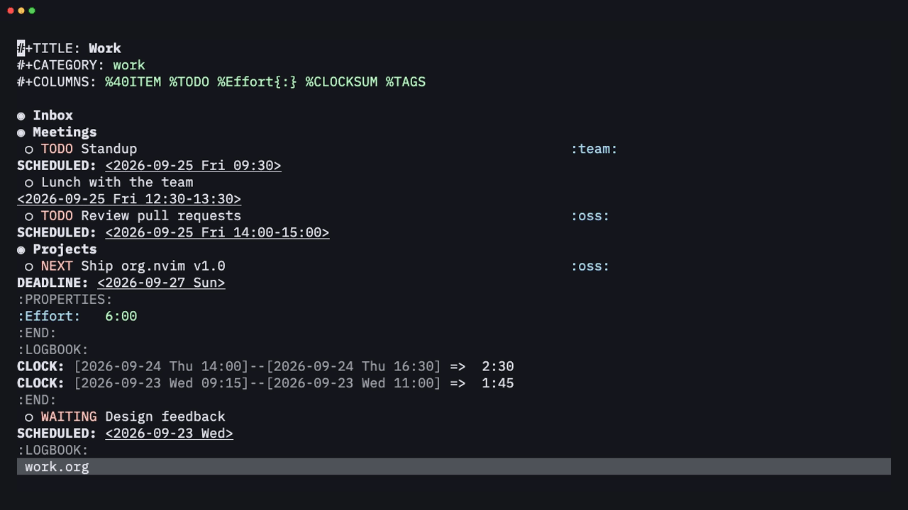

<details>
<summary>The week view</summary>

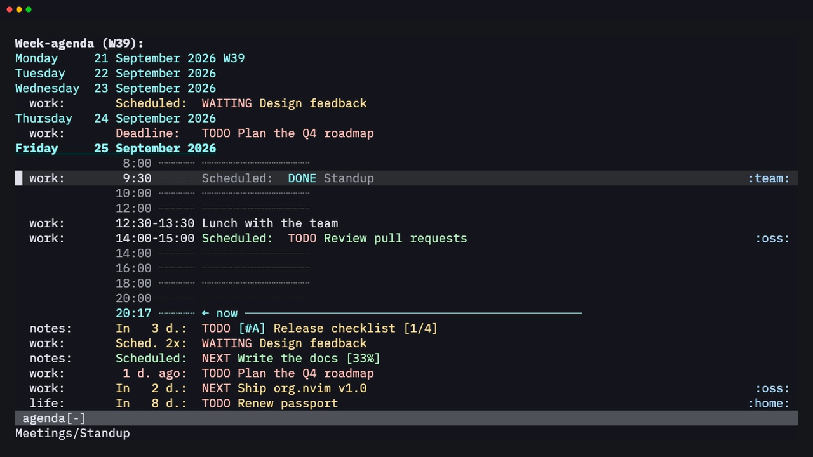

</details>

The dispatcher has the other Emacs views too: every TODO (`t`), a
tags/property match (`m`, here `+oss`) and a word search (`s`).


### Capture from anywhere

Press `<leader>oc` in any buffer and pick a template. Templates can be
grouped under a prefix key (`w` → `t` here). Type the task and finish with
`<C-c><C-c>` or `:w`. It's filed where the template says: under a
headline, an outline path or a date tree.

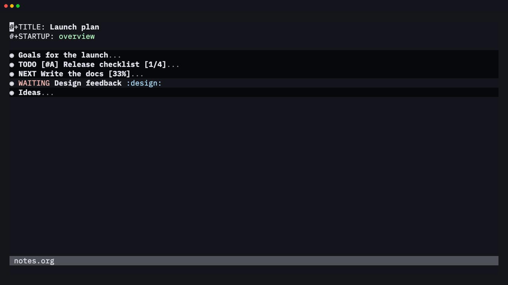

### Refile and archive

`<leader>or` moves a subtree under any heading in your agenda files (here
labelled with the file name). `<leader>o$` archives a finished subtree to
`<file>_archive` and keeps its context in `ARCHIVE_*` properties.


### Spreadsheet tables

Type a rough table, press `<C-c><C-c>` on its `#+TBLFM` line, and it
aligns itself and evaluates its formulas with a Calc-compatible evaluator.
Change a value, recalculate with `<leader>oTf`, and the totals follow.

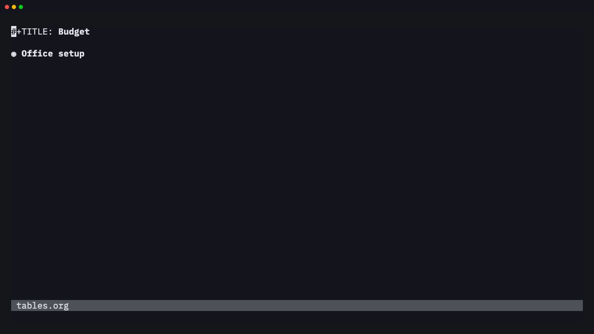

Rows and columns are easy to edit. `<leader>oTr` / `<leader>oTi` insert a
row or a column, `M-j` / `M-k` and `M-h` / `M-l` move them, and
`<leader>oTR` / `<leader>oTI` delete them. Formulas in `#+TBLFM` are
rewritten to follow the moves.

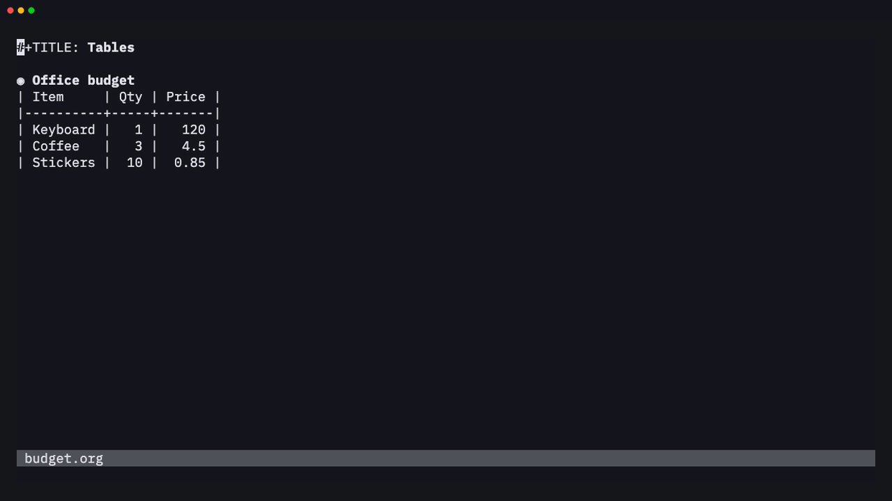

`<leader>oTs` sorts the rows (alphabetically, numerically, by date or with
a function), and `<leader>oTt` transposes the table. Type `:=` followed by
a formula in a field to add a field formula to `#+TBLFM`.


### Code that runs in your notes

`<C-c><C-c>` on a source block runs it asynchronously and writes the
output back into the file:


Python, shell, Lua (in-process), Node, Ruby, R, Go, SQLite and more are
supported, along with `:var`, `:noweb`, `:wrap`, `:cache`, `#+CALL`, inline
`src_lang{…}` blocks and tangling.

`<leader>o'` opens a block in its own buffer with the language's filetype,
so it gets that language's highlighting, indentation and filetype plugins.
`<C-c>'` writes it back.

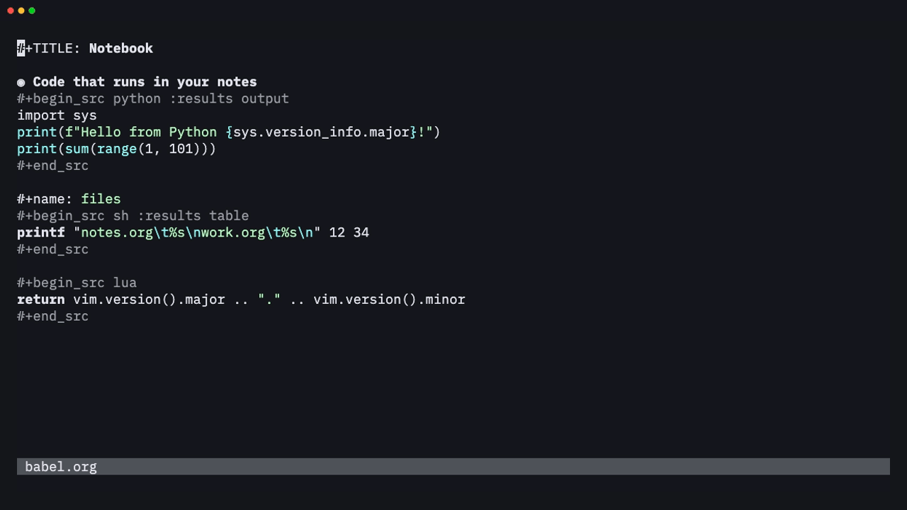

### Clocking, clock tables and column view

`<leader>oxi` clocks in, and the statusline shows the running total
against the effort estimate. `<leader>oxr` inserts a clock table that
matches Emacs's output. `<leader>oC` opens column view, which sums
efforts and clocked time up the tree.

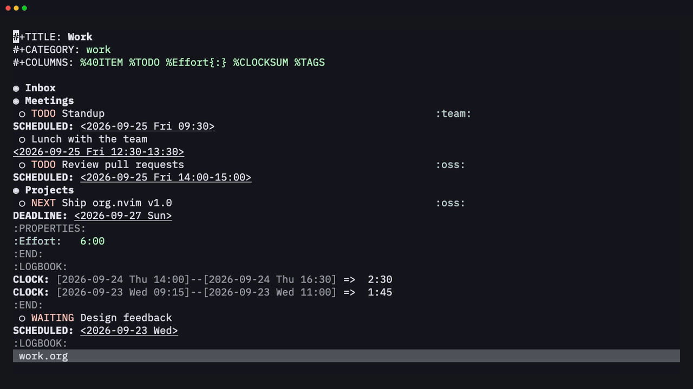

### Links

`<leader>ols` stores a link to the current heading (or file, line or ID),
and `<leader>oli` inserts it with completion. Links show only their
description. `<CR>` follows them, and `<leader>olt` shows the raw text.


### Sparse trees

`<leader>o/` folds the file down to what matters: TODO entries, a regexp,
a tag or property match, or deadlines. The matches are highlighted, and
`<C-c><C-c>` clears the highlights.


### Export

`<leader>oe` opens the export dispatcher. The HTML, LaTeX, Beamer,
Markdown, ASCII, Org and iCalendar back-ends are ports of Emacs's, and
pandoc handles DOCX, ODT, EPUB and more. You can export to a buffer to
check the result:

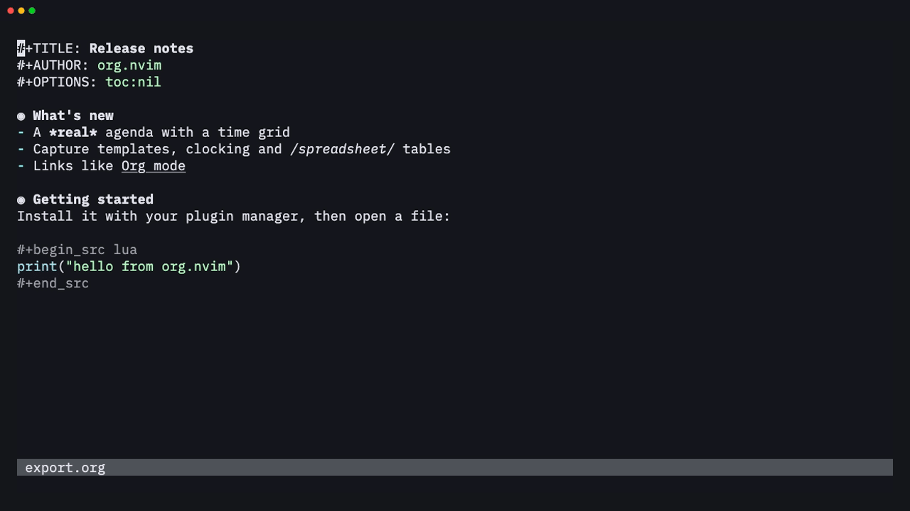

### And the rest

| Markup, links, lists and properties | Export dispatcher |
| --- | --- |
| 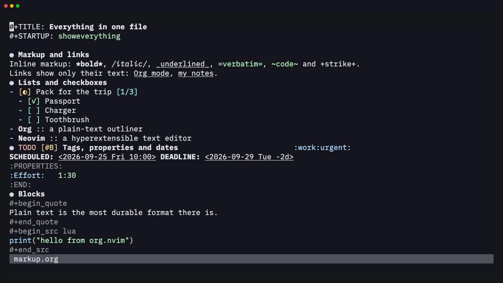 | 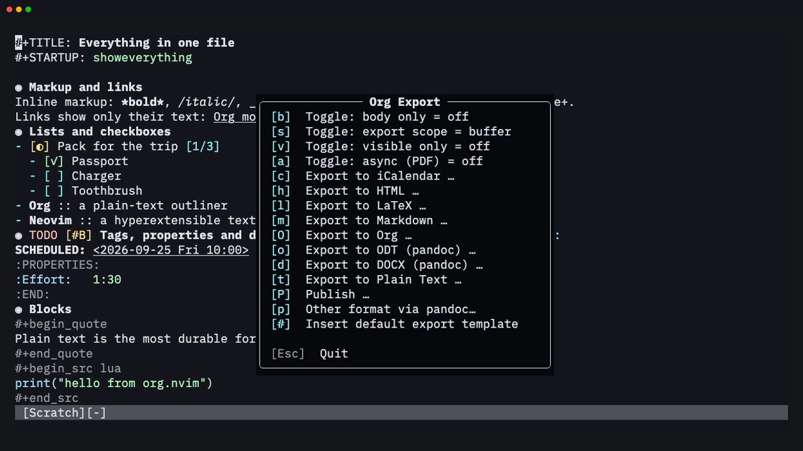 |

Lost? Press `g?` in any org or agenda buffer to list every keymap
available there:

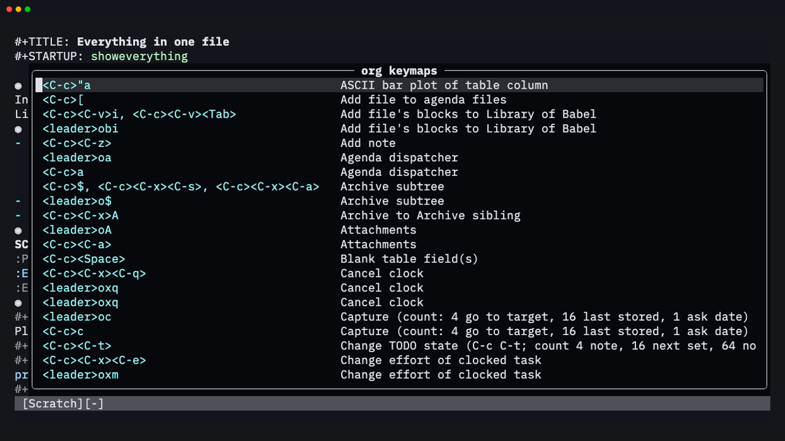

---

## ✨ Features

| | Area | Highlights |
| --- | --- | --- |
| 🌳 | **Outline** | Headline folding with Emacs-style `TAB`/`S-TAB` cycling, `#+STARTUP` and `VISIBILITY` visibility, archived subtrees that stay folded, motions (`]]` `[[` `g{`), and text objects (`ih` `ah` `ir` `ar`) |
| ✂️ | **Structure editing** | A context-aware `M-RET`, promote and demote, move, cut/copy/paste/clone subtrees, sort, narrow, structure templates |
| 📋 | **Plain lists** | Every bullet style, checkboxes with a `[-]` partial state, `[2/5]` and `[40%]` statistics cookies, renumbering, `TAB` on a new item to indent it |
| ✅ | **TODO** | Multiple keyword sequences, fast selection, `!`/`@` logging, `LOGGING` / `LOG_INTO_DRAWER` properties, repeaters (`+1w`, `++1d`, `.+2d`, `REPEAT_TO_STATE`), `ORDERED` / `NOBLOCKING` dependencies, tag triggers, priorities |
| 🏷️ | **Tags and properties** | Fast tag selection with groups, tag changes over a selection, inheritance, `#+FILETAGS`, property drawers, `Effort`, `_ALL` values cycled with `S-Left`/`S-Right` |
| 📅 | **Dates** | A floating calendar that understands `+2w`, `fri 14:00`, `sep 15` and `w39`; `SCHEDULED`/`DEADLINE` with warning and delay periods; `<C-a>`/`<C-x>` on any part of a timestamp, minutes rounded to 5 |
| 🗓️ | **Agenda** | Day to year views, a time grid, habits, log, clock-report, entry-text and archive modes, the full Emacs match syntax, custom composite commands, tag/category/effort/regexp filters, bulk actions, follow mode, restriction lock |
| 📥 | **Capture** | Grouped templates; entry, item, checkitem and table-line types; file, headline, outline-path, date-tree, regexp, ID, clock and function targets; all the common `%`-escapes |
| 📦 | **Refile and archive** | Refile or copy subtrees or regions, with Emacs-style target specs, outline-path completion in steps and refile logging; archive to a file, heading, date tree or Archive sibling with the `ARCHIVE_*` context properties |
| 🔗 | **Links** | `file:` with `::line`, `::*heading`, `::#id` and `::/regex/`; `id:`, `<<targets>>`, `<<<radio targets>>>`, coderefs, `shell:`, `attachment:`, abbreviations, custom types, concealed display, store/insert last/all links |
| ⏱️ | **Clocking** | Clock in/out/cancel/jump, clock history with default and interrupted tasks, Emacs's clock resolution (keep, subtract, got-back) for dangling clocks and idle time, auto clock-out, effort estimates with an overrun alert, a statusline component, `clocktable` blocks matching Emacs output (`:step`, `:formula`, `:sort`, `:lang`…), agenda clock check, relative and countdown timers |
| 🧮 | **Tables** | Automatic alignment, column shrinking, row/column/cell editing with formula fixing, copy-down, CSV/TSV import and export, `#+TBLFM` formulas with a Calc-compatible evaluator, a formula editor and debugger, radio tables, orgtbl-mode and plots |
| 🧪 | **Babel** | Asynchronous execution in many languages, `:session` (shells, Python, Node, Ruby, Lua), inline `src_lang{…}` blocks and `call_name()`, `:results`, `:var` references that evaluate blocks (`name(x=1)`, slices, other files, IDs), `:noweb`, `:wrap`, `:cache`, `:file`, `#+CALL`, Library of Babel, tangling, optional evaluation on export, the `C-c C-v` commands, and editing a block in its own buffer with `C-c '` |
| 📤 | **Export** | A port of Emacs's export engine: HTML, LaTeX/PDF, Beamer, Markdown, ASCII, Org and iCalendar back-ends matching Emacs output, citations, publishing projects, every `#+OPTIONS` key, plus DOCX, ODT, EPUB and more through pandoc |
| 🎁 | **And more** | Footnotes, sparse trees, `org-lint`, entry encryption (`org-crypt`), `org-protocol`, inline tasks, org-num, pretty entities, appointment notifications, attachments, IDs, dynamic blocks, completion, `:checkhealth org` |

The full reference is in `:h org.nvim` ([`doc/org.txt`](doc/org.txt)).

---

## 📚 Contents

- [Requirements](#requirements)
- [Installation](#installation)
- [Quick start](#quick-start)
- [Keymaps](#keymaps)
- [Configuration](#configuration)
- [Capture templates](#capture-templates)
- [Custom agenda commands](#custom-agenda-commands)
- [Completion](#completion)
- [Statusline](#statusline)
- [Differences from Emacs Org mode](#differences-from-emacs-org-mode)
- [Roadmap](#-roadmap)
- [Contributing](#-contributing)

---

## Requirements

- Neovim **0.10+**. Nothing else is required.
- Optional:
  - `pandoc` for LaTeX, PDF, DOCX and ODT export.
  - `latexmk` or `pdflatex` for native PDF.
  - The language interpreters you want Babel to run.

---

## Installation

### LazyVim / lazy.nvim, with blink.cmp completion

```lua
-- ~/.config/nvim/lua/plugins/org.lua
return {
  {
    "xheisenbugx/org.nvim",
    main = "org",
    lazy = false,
    opts = {
      org_directory = "~/org",
      agenda_files = { "~/org/**/*.org" },
      default_notes_file = "~/org/refile.org",
    },
  },
  -- completion in blink.cmp (LazyVim default)
  {
    "saghen/blink.cmp",
    optional = true,
    opts = {
      sources = {
        per_filetype = { org = { inherit_defaults = true, "org" } },
        providers = { org = { name = "Org", module = "org.completion.blink" } },
      },
    },
  },
}
```

### Other plugin managers

Add the plugin to your `'runtimepath'` and call:

```lua
require("org").setup({ org_directory = "~/org" })
```

### Local development checkout

Point lazy.nvim at the directory instead of a GitHub repo:

```lua
{
  dir = "~/Workspace/orgmode",
  name = "org.nvim",
  main = "org",
  lazy = false,
  opts = { --[[ … ]] },
}
```

Restart Neovim (or run `:Lazy reload org.nvim`) and check the result with
`:checkhealth org`.

> [!TIP]
> **Keymap prefix.** All org commands live under `<leader>o` by default. If
> another plugin already uses it (obsidian.nvim, overseer), set
> `mappings = { prefix = "<leader>O" }` or any other prefix.

---

## Quick start

1. `mkdir ~/org` and open `~/org/todo.org`.
2. Type `* TODO Buy milk` and press `<leader>os` to schedule it for today.
3. `<leader>oa` → `a` opens the weekly agenda. `t` changes the state of the
   entry under the cursor, and `<CR>` jumps to it.
4. `<leader>oc` → `t` captures a new task from anywhere. Finish with
   `<C-c><C-c>` or `:w`.
5. Press `g?` in any org or agenda buffer to list its keymaps.

---

## Keymaps

`<prefix>` is `mappings.prefix` (default `<leader>o`). Every mapping can be
changed or disabled (`false`) under `mappings.<section>.<action>`. Keys
marked *(ctx)* depend on what's under the cursor. When they don't apply,
they fall back to the normal Vim behaviour (`>>` still indents plain text,
`<C-a>` still increments numbers).

### Emacs keys

Coming from Emacs? The standard Org keys work out of the box, on top of
the Vim-style ones: `C-c C-t`, `C-RET` / `C-S-RET`, `C-c C-s` / `C-c C-d`,
`C-c .`, `C-c C-q`, `C-c C-w`, `C-c C-x C-i` / `C-c C-x C-o`, `C-c C-l`,
`C-c C-e`, `C-c '`, `C-c C-v e`, `C-c =`, `C-c -`, `C-c ^` and about 90 more.
Context-sensitive keys behave as in Emacs (`C-c -` adds an hline in a table,
cycles a bullet on an item and toggles an item elsewhere). Use a count in
place of `C-u`: `4<C-c>.` inserts a timestamp with the time.

The full list is in `:h org-emacs-keys`. Turn them off with
`mappings = { emacs = false, emacs_insert = false, emacs_global = false }`.

### Global

| Key | Action |
| --- | --- |
| `<prefix>a` | Agenda dispatcher |
| `<prefix>c` | Capture |
| `<prefix>g` | Go to any heading in the agenda files |
| `<prefix>ls` | Store a link to the current location |
| `<prefix>xj` / `xo` / `xq` | Go to clocked task / clock out / cancel clock |

<details>
<summary><b>Org buffers</b> (click to expand)</summary>

| Key | Action |
| --- | --- |
| `<Tab>` / `<S-Tab>` | Cycle subtree / global visibility *(ctx: in insert mode, next table field or cycle the level of a new empty heading/item)* |
| `<C-c><C-c>`, `<prefix><CR>` | Context action: toggle checkbox, align/recalc table, run src block, update dblock/clock line/cookie, set tags on headline, property menu on a property line, clear sparse-tree highlights… |
| `<CR>`, `gx`, `<prefix>o` | Open link / footnote / date at point *(ctx)* |
| `<M-CR>` / `<M-S-CR>` | New heading, item or row / new TODO heading or checkbox item |
| `<prefix>ih` `it` `is` | Insert heading / TODO heading / subheading |
| `<prefix>id` `ib` `if` | Insert drawer / block template / footnote (on a footnote: jump; count: sort/renumber/normalize/delete menu) |
| `<<` `>>` / `<s` `>s` | Promote/demote heading or item / subtree *(ctx)* |
| `<M-h>` `<M-l>` (also `<M-Left>` `<M-Right>`) | Promote / demote heading or item (Visual: every headline); move table column *(ctx)* |
| `<M-k>` `<M-j>` (also `<M-Up>` `<M-Down>`) | Move subtree, item or table row up / down *(ctx)* |
| `<M-H>` `<M-L>` `<M-K>` `<M-J>` | Subtree promote/demote; table delete/insert column, delete/insert row; elsewhere drag the line up/down *(ctx)* |
| `<prefix>K` / `<prefix>J` | Move subtree up / down |
| `<prefix>hy` `hd` `hp` `hc` | Copy / cut / paste / clone subtree |
| `<prefix>hs` `hn` `hC` `hA` `hb` | Sort / narrow / toggle COMMENT / toggle ARCHIVE tag / cycle bullet |
| `<prefix>*` / `<prefix>-` | Toggle heading / list item |
| `cit` / `ciT` / `<prefix>T` | Next / previous / select TODO state |
| `<S-Right>` `<S-Left>` | Next/previous TODO; date ±1 day; next/previous allowed property value; cycle bullet *(ctx)* |
| `<S-Up>` `<S-Down>`, `<C-a>` `<C-x>` | Priority or timestamp part up/down; previous/next list item *(ctx)* |
| `<prefix>,` `t` `p` `P` | Priority / tags (Visual: add/remove a tag on each headline; count: realign all) / set property / delete property |
| `<prefix>s` `d` `i.` `i!` | Schedule / deadline / active / inactive timestamp |
| `<C-Space>`, `<prefix>#` | Toggle checkbox (Visual: every item; count 4: remove, 16: `[-]`) / update statistics cookies |
| `<prefix>xi` `xo` `xq` `xj` | Clock in (count: pick from history) / out / cancel / goto |
| `<prefix>xe` `xE` `xm` `xz` | Set effort / next allowed effort / change clocked effort / resolve dangling clocks |
| `<prefix>xr` `xd` `xu` `xU` `C` | Insert clocktable / show clock sums / update dblock(s) / column view |
| `<prefix>li` `ls` `lt` `ln` `lp` `lI` | Insert / store link, toggle link display, next/prev link, create ID |
| `<prefix>lL` `lA` `lg` `ly` | Insert last / all stored links, go to ID, copy ID |
| `<prefix>r` `R` `$` `A` | Refile / copy to a refile target / archive subtree / attachments |
| `<prefix>/` `e` | Sparse tree / export dispatcher |
| `<prefix>Tc` `T-` `Tf` `Ts` `Tr` `TR` `Ti` `TI` | Table: create/convert, hline, recalc, sort, insert/delete row, insert/delete column |
| `<prefix>Tt` `T#`, `<S-CR>`, `<S-arrows>` | Table: transpose, rotate recalc mark, copy field down (with increment), swap field with neighbour |
| `<prefix>'` | Edit src block or table formulas in a separate buffer |
| `<prefix>be` `bb` `bs` `bt` `bk` `bn` `bp` | Babel: execute block/buffer/subtree, tangle, remove result, next/prev block |
| `<prefix>bv` `bd` `bg` `br` `bo` `bj` `bi` | Babel: expand, split/wrap, go to named block/result, open result, insert header arg, ingest library |
| `<prefix>bz` `bZ` `bl` `bK` | Babel sessions: show session, show session + edit block, load block into session, kill session |
| `]]` `[[` `][` `[]` `g{` `<prefix>.` | Next/prev heading, next/prev sibling, parent, pick heading |
| `ih` `ah` `ir` `ar` | Text objects: heading section / subtree |
| `g?` | Show all keymaps |

</details>

<details>
<summary><b>Agenda buffer</b> (click to expand)</summary>

| Key | Action | Key | Action |
| --- | --- | --- | --- |
| `f` / `b` / `.` | later / earlier / today | `vd` `vw` `vt` `vm` `vy` | day / week / fortnight / month / year |
| `gd` | go to date | `r` | redo |
| `<CR>` / `<Tab>` / `<Space>` / `L` | switch to / go to / show / show and recenter | `F` | follow mode |
| `t`, `<C-S-Right/Left>` | change TODO | `,` `+` `-` | set/raise/lower priority |
| `:` / `T` | set / show tags | `s` / `d` | schedule / deadline |
| `<S-Right>` / `<S-Left>` / `>` | date +1 / −1 / prompt | `e` / `<C-c><C-x>p` | effort / property |
| `I` `O` `X` `J` | clock in / out / cancel / goto | `R` / `$` / `a` | refile / archive / archive with confirmation |
| `<C-c><C-x>A` / `<C-c><C-x>a` | archive sibling / ARCHIVE tag | `<C-k>` / `<C-c><C-o>` | delete entry / open link |
| `z` | add note | `c` | capture (at the date at point) |
| `l` `vL` / `C` | log mode (all) / clock report | `E` / `G` | entry text / time grid |
| `va` / `vA` / `v[` | archived trees / archive files / inactive timestamps | `/` `<` `=` `_` `^` `\|` | filter tag / category / regexp / effort / top headline / clear |
| `[` `]` `{` `}` | add +word / -word / +{re} / -{re} to the query | `n` / `p`, `<C-c><C-n/p>` | next / previous item, date line |
| `m` `u` `U` `B` | mark / unmark / unmark all / bulk action | `<M-m>` `*` `<M-*>` `%` | toggle / mark all / toggle all / mark regexp |
| `<C-x><C-s>` / `<C-x><C-w>` | save org buffers / export agenda | `q` / `x` | quit / quit and wipe |

</details>

<details>
<summary><b>Capture and edit buffers</b> (click to expand)</summary>

| Key | Capture | Edit src (`C-c '`) |
| --- | --- | --- |
| `<C-c><C-c>`, `<prefix>w`, `:w` | finalize | — |
| `<C-c>'`, `<prefix>'` | — | save and exit (`:w` writes back) |
| `<C-c><C-k>`, `<prefix>k` | abort | abort |
| `<C-c><C-w>`, `<prefix>r` | refile | — |

</details>

---

## Configuration

Every option with its default is in [`lua/org/config.lua`](lua/org/config.lua)
and documented in `:h org-config`. The most common ones:

```lua
require("org").setup({
  org_directory = "~/org",
  agenda_files = { "~/org/**/*.org", "~/work/notes.org" },
  default_notes_file = "~/org/refile.org",

  todo_keywords = { "TODO(t) NEXT(n) WAITING(w@/!) | DONE(d!) CANCELLED(c@)" },
  log_done = "time",          -- false | "time" | "note"
  log_into_drawer = "LOGBOOK",
  tags = { "work(w)", "home(h)", "{", "@office(o)", "@remote(r)", "}" },
  tags_column = -77,
  startup_folded = "overview",
  deadline_warning_days = 14,

  agenda = { span = "week", start_on_weekday = 1, window = "current" },
  capture = { templates = { --[[ see below ]] } },
  refile = { max_level = 3 },
  notifications = { enabled = true, reminder_time = { 10, 0 } },

  ui = {
    bullets = { "◉", "○", "✸", "✿" },      -- or false
    checkboxes = { " ", "◐", "✓" },        -- or false
    hide_emphasis_markers = false,
    indent_mode = false,                   -- org-indent-mode
    todo_keyword_faces = { WAITING = ":foreground #e0af68 :weight bold" },
  },

  mappings = {
    prefix = "<leader>o",
    org = { toggle_checkbox = "<C-Space>", open_at_point = { "<CR>", "gx" } },
    agenda = { goto_date = "gd" },
  },
})
```

---

## Capture templates

```lua
capture = {
  templates = {
    t = { description = "Task", template = "* TODO %?\n  %U\n  %a", target = "~/org/refile.org" },
    w = "Work",                                          -- a group: w → wt, wm
    wt = { description = "Work task", template = "* TODO %? :work:", target = "~/org/work.org", headline = "Inbox" },
    wm = { description = "Meeting", template = "* %^{Who} %^g\n  %T\n  %?", target = "~/org/work.org", olp = { "Meetings" }, clock_in = true },
    j = { description = "Journal", template = "* %<%H:%M> %?", target = "~/org/journal.org", datetree = true },
    c = { description = "Checklist item", type = "checkitem", template = "[ ] %?", target = "~/org/todo.org", headline = "Shopping" },
    l = { description = "Log line", type = "table-line", template = "| %U | %^{Amount} | %^{What} |", target = "~/org/log.org", headline = "Expenses", immediate_finish = true },
  },
  window = "split",  -- "split" (like Emacs) | "float" | "vsplit" | "tab" | "current"
}
```

Target options:

- `target`: the file to capture into (`""` or none: `default_notes_file`).
- `headline`: a headline in the target, created if it doesn't exist.
- `olp`: an outline path, as a list of headlines (they must exist).
- `datetree`: `true`, or `{ tree_type = "week" | "month" | { "year", "quarter", ... } }`.
- `regexp`: a Vim regexp; the text goes where the first match ends.
- `func` / `location`: functions choosing the position (file+function /
  function targets).
- `id`: insert under the entry with this ID.
- `target = "clock"`: insert under the task being clocked.

Without any template, Emacs's "t" Task template is used (a TODO under
"Tasks" in `default_notes_file`). `capture.templates_contexts` limits
templates to some buffers (org-capture-templates-contexts).

Other options: `type`, `prepend`, `empty_lines`, `table_line_pos`,
`properties`, `immediate_finish`, `jump_to_captured`, `kill_buffer`,
`refile_targets`, `clock_in`, `clock_keep`, `clock_resume`,
`time_prompt`, `no_save`, and the `prepare_finalize`, `before_finalize`
and `after_finalize` hook functions.

<details>
<summary><b>Template expansions</b> (click to expand)</summary>

| Escape | Inserts |
| --- | --- |
| `%?` | cursor position |
| `%t` `%T` `%u` `%U` | date / date+time, active / inactive |
| `%^t` `%^T` `%^u` `%^U` | same, but prompts with the calendar |
| `%<%Y-%m-%d>` | strftime format |
| `%a` `%A` `%l` `%L` | annotation link: plain / with description prompt / without description / bare target |
| `%i` | initial content (the visual selection), the text before it repeated on each line |
| `%x` `%c` | clipboard / last yank |
| `%f` `%F` | origin file name / full path |
| `%n` | your full name |
| `%^{prompt\|default\|opt}` | prompt with a default and options |
| `%\1` `%\*1` | the answer to the first `%^{...}` prompt / to the first prompt of any kind |
| `%^g` `%^G` | tags prompt |
| `%^{PROP}p` | property prompt |
| `%k` `%K` | the running clock's task / a link to it |
| `%(expr)` | the value of a Lua expression (Emacs: elisp) |
| `%[file]` | the contents of a file |
| `\%` | a literal `%` before an escape character (`%%` is not an escape, as in Emacs) |

</details>

---

## Custom agenda commands

```lua
agenda = {
  custom_commands = {
    w = {
      description = "Work overview",
      types = {
        { type = "agenda", span = "day", header = "Today" },
        { type = "tags_todo", match = "+work-someday/!", header = "Open work tasks" },
        { type = "todo", match = "WAITING", header = "Waiting for" },
      },
    },
    u = { description = "Urgent", type = "tags", match = 'PRIORITY="A"|+urgent' },
  },
}
```

Block types: `agenda`, `todo`, `tags`, `tags_todo`, `search`, `stuck`.
Per-block options: `match`, `header`, `span`, `start_day`, `files`,
`skip = function(headline) … end`, and the `todo_ignore_*` flags.
Like Emacs' `org-agenda-skip-entry-if`, `require("org.agenda").skip_entry_if("scheduled", "deadline")`
and `skip_subtree_if("regexp", ":someday:")` build `skip` functions.

The match syntax is the same as in Emacs. Some examples:

- `+work-boss`
- `work|home`
- `LEVEL>1`
- `Effort<"1:00"`
- `SCHEDULED<="<+2d>"`
- `+proj/NEXT|TODO`
- `/!` (only entries that aren't done)

---

## Completion

- **blink.cmp:** add the provider shown in [Installation](#installation).
- **nvim-cmp:**
  ```lua
  require("cmp").register_source("org", require("org.completion.cmp").new())
  ```
  Then add `{ name = "org" }` to your org sources.
- **Built in:** `<C-x><C-o>` (omnifunc).

It completes TODO keywords, tags, `#+` keywords, `#+STARTUP` and
`#+OPTIONS` values, src block languages, property names, link types,
headings (`[[*`), custom IDs (`[[#`) and stored links.

---

## Statusline

```lua
-- lualine (LazyVim)
{
  "nvim-lualine/lualine.nvim",
  optional = true,
  opts = function(_, opts)
    table.insert(opts.sections.lualine_x, 1, { function() return require("org").statusline() end })
  end,
}
```

While a clock runs, it shows something like `⏱ [0:25/1:00] (Write report)`,
followed by the timer (`⏲ 0:12:34`) when one runs. It's empty otherwise.

---

## Differences from Emacs Org mode

The goal is Emacs Org 9.8 parity: option defaults are Emacs's (so a fresh
setup behaves like a fresh Emacs: no agenda files, `TODO | DONE`, nothing
logged on DONE, files open expanded), and behaviour is checked against Emacs
run in batch mode. What can't work the same way is listed with the reason in
`:h org-differences`. The main points:

- **No Emacs Lisp.** `elisp:` links, emacs-lisp Babel blocks, `%(sexp)` in
  capture templates, `#+BIND` and Elisp in header arguments can't run;
  Lua functions take their place where a hook or function is expected.
  Table `'(...)` formulas run on a small Lisp evaluator, and GNU Calc is
  reimplemented only for what tables use.
- **Emacs applications** (Gnus, mu4e, BBDB, the diary, the calendar's
  commands) have no counterpart; common diary sexps such as
  `%%(org-anniversary ...)`, `%%(diary-float ...)` and
  `%%(org-calendar-holiday)` (with Emacs's holiday lists) are emulated.
- **Display:** inline image and LaTeX previews need an image protocol core
  Neovim lacks; hiding body text between visible headlines needs Neovim
  0.11 (`conceal_lines`); column view is a table view, not overlays.
- **Point vs cursor:** Emacs acts between characters, Normal mode on a
  character, so commands that insert "at point" act at the end of the line
  in Normal mode (at the cursor in Insert mode).
- **Prefix arguments** are counts (4 = C-u, 16 = C-u C-u, 64 = C-u C-u C-u).
- Babel sessions run each block as one request (not a full REPL), and Lua
  blocks run inside Neovim.
- MobileOrg is not supported (the apps are unmaintained).

---

## 🗺️ Roadmap

Ideas that would need more than core Neovim:

- [ ] Inline image and LaTeX previews through image.nvim / snacks.image
- [ ] Column view as overlays on headlines
- [ ] Async Babel sessions (`:async`)

If there's something you'd like that isn't here,
[open an issue](https://github.com/xheisenbugx/org.nvim/issues).

---

## 🤝 Contributing

Contributions of all sizes are welcome: bug reports, docs fixes, new link
types, Babel languages, exporters, or anything on the roadmap. Each piece
of Org lives in its own small module, and there's a fast headless test
suite, so it's easy to get started:

```sh
git clone https://github.com/xheisenbugx/org.nvim && cd org.nvim
make test                                 # run all specs headlessly
make test SPEC=tests/spec/agenda_spec.lua # one spec
make lint                                 # stylua --check
```

[`CONTRIBUTING.md`](CONTRIBUTING.md) explains how the code is organised
and how to add a feature.

---

<div align="center">

**If org.nvim makes your notes, tasks or agenda better, give it a ⭐.**
It helps other Neovim users find it.

You can also [buy me a coffee on Ko-fi ☕](https://ko-fi.com/xheisenbugx).

</div>
